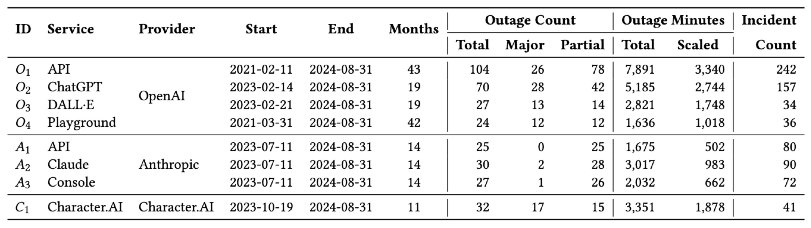

# llm-service-analysis
Artifact for "An Empirical Characterization of Outages and Incidents in Public Services for Large Language Models" (ICPE'25)


## Description

A toolbox for automatically collecting and systematically analyzing self-reported outage and incident data from OpenAI ([https://status.openai.com/](https://status.openai.com/)), Anthropic ([https://status.anthropic.com/](https://status.anthropic.com/)), and CharacterAI ([https://status.character.ai/](https://status.character.ai/)).

## Setup
Set up a Python environment and install requirements to run the Jupyter Notebooks for (re-)producing results.

```shell
conda env create -f environment.yml
conda activate llm-analysis
```


## Scripts

| Script Name| Section | Description | Products
|--------------|----------|----------------|-----------------|
|sec1-chatgpt_website_visits.ipynb| Section 1|Monthly website visits, outages, and incidents for ChatGPT.|Figure 1|
|sec2.1-failure_recovery_modeling.ipynb| Section 2.1|Plots for failure recovery modeling. | Figure 2, Table 2
|sec3.2-scraper_uptime_page.py | Section 3.2 | Python script for collecting outage data from uptime pages. | Raw outage data|
|sec3.2-scraper_incident_page.py |Section 3.2 | Python script for collecting incident reports data from incident history pages. | Raw incident data|
|sec3.2-transformation_uptime.ipynb| Section 3.2 | Data transformation to get cleaned outage dataset.| Table 3|
|sec3.2-transformation_incidents.ipynb| Section 3.2 | Data transformation to get cleaned incident dataset.|Table 4|
|sec4-failure_recovery_analysis.ipynb| Section 4 |Plots for failure recovery analysis.| Figure 3, 4, 5, 6, Table 5, 6 |
|sec5-temporal_analysis.ipynb| Section 5.1, 5.2 |Plots for temporal distributions and auto-correlations.| Figure 7, 8 |
|sec5.3-service_availability.ipynb | Section 5.3 |Plots for service availability. | Figure 9, Table 7|
|sec6-co_occurrence_failures.ipynb| Section 6|Plots for co-occured outage, and incident impact range.|Figure 10, 11, Table 8|

## Datasets
Data used for this project is available in the `data` folder. 
Raw and cleaned datasets are also published on [Zenodo](https://zenodo.org/records/14018219).

Outage dataset overview:
 

Incident dataset overview:
 


To collect the updated datasets by yourself, use the following scripts:

```shell
python sec3.2-scraper_uptime_page.py -S <service> 
```

```shell
python sec3.2-scraper_incident_page.py 
```